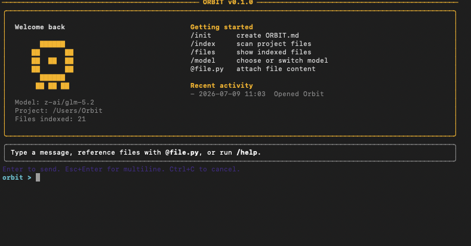

# ORBIT

[](https://www.python.org/)
[](LICENSE)
[](https://openrouter.ai/)
[](https://github.com/S3eeDTR/Orbit/releases)

A modern terminal-first AI coding assistant powered by OpenRouter.

---

> **Warning**
>
> ORBIT is currently under active development. Features, commands, and APIs may change before the first stable release.

## Overview

ORBIT is an open-source AI developer CLI inspired by modern coding assistants such as Claude Code and Gemini CLI.

It provides a fast, project-aware terminal interface for interacting with hundreds of large language models through OpenRouter while maintaining a consistent developer experience.

Unlike provider-specific tools, ORBIT separates the developer workflow from the underlying model, allowing you to switch between models without changing your tooling.

The long-term vision is to build a complete AI development environment capable of:

- Understanding entire codebases
- Working with multiple files simultaneously
- Executing developer tools
- Editing source code
- Managing project memory
- Supporting autonomous development workflows

---

## Screenshot

<p align="center">
  
</p>


# Features

## Current

- Interactive terminal interface
- Support for all OpenRouter models
- Interactive model switching
- Persistent conversation history
- Rich terminal rendering
- Markdown rendering
- Syntax highlighted code blocks
- Local configuration management
- Project indexing
- File attachment support using `@filename`
- Session statistics
- Project-aware conversations

---

## Planned

- Streaming responses
- Git integration
- Shell tool execution
- Automatic project context retrieval
- File editing
- Workspace memory
- MCP (Model Context Protocol)
- Plugin system
- Multi-agent workflows
- Autonomous coding tasks

---

# Installation

Clone the repository

```bash
git clone https://github.com/S3eeDTR/Orbit.git
cd Orbit
```

Install ORBIT

```bash
pip install -e .
```

Launch ORBIT

```bash
orbit
```

---

# Requirements

- Python 3.11 or newer
- OpenRouter API Key

Create a free API key at

https://openrouter.ai/keys

---

# First Run

The first time ORBIT starts it will automatically:

1. Request your OpenRouter API key
2. Verify the API key
3. Download the latest available models
4. Ask you to choose a default model
5. Save your configuration locally

Configuration is stored under

```text
~/.config/orbit/
```

The configuration directory contains:

```text
config.json
models.json
history.json
recent.json
sessions/
cache/
logs/
```

---

# Quick Start

Start ORBIT

```bash
orbit
```

Example conversation

```text
orbit > Explain @client.py

orbit > Review this project and suggest improvements.

orbit > /model

orbit > Refactor @project.py

orbit > Show me possible performance improvements.
```

---

# Commands

| Command | Description |
|----------|-------------|
| `/help` | Display available commands |
| `/models` | List all available models |
| `/model` | Open the interactive model selector |
| `/model <number>` | Switch using the model number |
| `/model <model-id>` | Switch using the full model identifier |
| `/clear` | Clear the current conversation |
| `/stats` | Display session statistics |
| `/index` | Scan and index the current project |
| `/files` | Show indexed project files |
| `/save` | Save the current conversation |
| `/exit` | Exit ORBIT |

---

# Working With Files

ORBIT understands local project files.

Reference a file simply by prefixing it with `@`.

Example

```text
Explain @main.py
```

Review a module

```text
Review @database.py
```

Compare two files

```text
Compare @client.py with @client_old.py
```

Review multiple files

```text
Review @client.py @models.py @config.py
```

When referenced, ORBIT automatically reads the file contents and includes them in the model context.

---

# Model Selection

ORBIT supports every model available through OpenRouter.

Switch models interactively

```text
/model
```

Switch using the displayed number

```text
/model 14
```

Or use the complete model identifier

```text
/model anthropic/claude-opus-4.1
```

You can switch models at any time without restarting the application.

# Project Structure

```
Orbit/
│
├── orbit/
│   ├── __init__.py
│   ├── __main__.py
│   ├── app.py
│   ├── banner.py
│   ├── chat.py
│   ├── client.py
│   ├── commands.py
│   ├── config.py
│   ├── constants.py
│   ├── models.py
│   ├── project.py
│   ├── prompt_shell.py
│   ├── sessions.py
│   └── ui.py
│
├── .gitignore
├── LICENSE
├── pyproject.toml
├── README.md
├── CHANGELOG.md
└── CONTRIBUTING.md
```

The project is intentionally organized into small, focused modules to make it easier to understand, maintain, test, and extend.

Each module has a single responsibility, allowing new features to be added without affecting unrelated parts of the codebase.

---

# Architecture

```
                          User
                           │
                           ▼
                  Interactive Terminal
                           │
                           ▼
                   Prompt Toolkit UI
                           │
                           ▼
                  Command Dispatcher
                           │
        ┌──────────────────┴──────────────────┐
        │                                     │
        ▼                                     ▼
   Conversation Engine                 Project Manager
        │                                     │
        │                             Project Index
        │                             File Context
        │
        ▼
   OpenRouter Client
        │
        ▼
 OpenRouter REST API
        │
        ▼
 Large Language Model
```

---

# Module Overview

| Module | Responsibility |
|----------|----------------|
| `app.py` | Main application lifecycle |
| `chat.py` | Conversation management |
| `client.py` | OpenRouter API client |
| `commands.py` | CLI command dispatcher |
| `config.py` | Configuration management |
| `constants.py` | Global constants |
| `models.py` | Model discovery and selection |
| `project.py` | Project indexing and file handling |
| `prompt_shell.py` | Interactive prompt interface |
| `sessions.py` | Conversation persistence |
| `ui.py` | Terminal rendering utilities |
| `banner.py` | Startup dashboard |

Each module has a single responsibility, making ORBIT easy to understand and extend.

---

# Configuration

ORBIT stores all local data inside

```text
~/.config/orbit/
```

Typical structure

```
orbit/

config.json
models.json
history.json
recent.json

cache/
logs/
sessions/
```

No project files are modified.

Project-specific metadata is stored locally unless explicitly requested.

---

# Project Indexing

ORBIT can scan a project and build a lightweight index of supported source files.

Supported file types include

```
Python
JavaScript
TypeScript
JSON
YAML
Markdown
HTML
CSS
Shell scripts
SQL
PowerShell
```

Large dependency folders are automatically ignored.

Examples include

```
.git
node_modules
__pycache__
dist
build
.venv
```

The generated index enables

- Fast file discovery
- Autocomplete
- File references
- Project-aware conversations

---

# File Context

Files can be attached directly to prompts.

```
Explain @main.py
```

```
Review @client.py
```

```
Compare @config.py and @constants.py
```

ORBIT safely reads the referenced files and injects their contents into the conversation.

Files outside the project root cannot be accessed.

---

# Session Management

Every conversation exists as an independent chat session.

ORBIT keeps track of

- Active model
- Conversation history
- Token usage
- Estimated cost
- Session duration

Sessions can also be saved for later reference.

---

# Model Management

Available models are automatically retrieved from OpenRouter.

The local cache stores

- Model IDs
- Context length
- Pricing
- Provider information

Users may switch between models at any point without restarting the application.

---

# Design Principles

ORBIT is built around several core principles.

### Terminal First

The command line remains the primary interface.

No graphical interface is required.

---

### Provider Agnostic

The application should never depend on a single model provider.

OpenRouter provides access to hundreds of models while ORBIT maintains a consistent workflow.

---

### Project Awareness

ORBIT understands software projects rather than isolated prompts.

Future releases will include

- semantic project search
- repository memory
- dependency awareness
- architecture understanding

---

### Extensibility

Every subsystem is designed to be replaceable.

Future integrations include

- Git
- Docker
- MCP servers
- Local LLMs
- Ollama
- LM Studio
- External plugins

---

### Simplicity

The codebase intentionally avoids unnecessary abstractions.

Each module has a clear purpose.

The project aims to remain approachable for contributors while still supporting advanced functionality.

---

# Technology Stack

ORBIT is built using

- Python 3.11+
- OpenRouter API
- Rich
- prompt_toolkit
- Requests

Future releases may introduce optional integrations for

- GitPython
- Tree-sitter
- SQLite
- ChromaDB
- FAISS
- Ollama
- MCP SDK

These components will remain optional where possible.

---

# Why ORBIT?

Most AI coding assistants are tightly coupled to a single provider.

ORBIT separates the user experience from the underlying language model by using OpenRouter as the backend.

This enables developers to switch between models from

- OpenAI
- Anthropic
- Google
- Meta
- Mistral
- Qwen
- DeepSeek
- and many others

without changing tools or workflows.

The long-term vision is to provide a consistent development experience regardless of which language model is used.


# Contributing

Contributions of all sizes are welcome.

Whether you are fixing a bug, improving documentation, proposing a new feature, or refactoring existing code, your contribution is appreciated.

If you are planning a significant feature or architectural change, please open an issue first so the design can be discussed before implementation begins.

---

# Development Setup

Clone the repository

```bash
git clone https://github.com/S3eeDTR/Orbit.git
cd Orbit
```

Install the project in editable mode

```bash
pip install -e .
```

Run ORBIT

```bash
orbit
```

Alternatively

```bash
python -m orbit
```

---

# Coding Standards

When contributing to ORBIT, please follow these guidelines.

- Target Python 3.11+
- Prefer type hints
- Keep functions focused and easy to understand
- Write descriptive commit messages
- Follow PEP 8
- Avoid unnecessary dependencies
- Keep modules small and maintainable

---

# Roadmap

The following roadmap outlines the long-term direction of the project.

## v0.2

- Streaming responses
- Improved terminal rendering
- Better model management
- Improved autocomplete
- Conversation export

---

## v0.3

- Git integration
- File editing
- Shell tool execution
- Automatic project context
- Better project indexing

---

## v0.4

- Semantic code search
- Workspace memory
- Intelligent project navigation
- Built-in diff viewer
- Better file attachment support

---

## v0.5

- Tool calling
- Local command execution
- Agent planning
- Task management
- Project summaries

---

## v1.0

- Multi-agent workflows
- Plugin system
- MCP integration
- Workspace memory
- Local model support
- Autonomous coding workflows
- Cross-platform installer

---

# Frequently Asked Questions

## Why OpenRouter?

OpenRouter provides access to hundreds of language models through a single API.

ORBIT focuses on providing a consistent developer experience while allowing users to choose whichever model best suits their workflow.

---

## Does ORBIT support local models?

Not yet.

Local model support through Ollama and other providers is planned for future releases.

---

## Is my code uploaded?

Only the files you explicitly reference (for example `@client.py`) are sent to the selected language model.

ORBIT does not automatically upload your entire project.

Future versions may include configurable project context.

---

## Does ORBIT edit files?

Not yet.

Current releases focus on understanding, reviewing, and explaining code.

Native file editing is planned.

---

## Can I use ORBIT with any OpenRouter model?

Yes.

ORBIT is designed to work with every model exposed through the OpenRouter API.

---

# Security

If you discover a security issue, please avoid opening a public issue.

Instead, contact the maintainer directly so the issue can be investigated and resolved before public disclosure.

---

# Versioning

ORBIT follows Semantic Versioning.

```
MAJOR.MINOR.PATCH
```

For example

```
0.1.0
```

- MAJOR — Breaking changes
- MINOR — New functionality
- PATCH — Bug fixes

---

# License

ORBIT is released under the MIT License.

See the `LICENSE` file for details.

---

# Acknowledgements

ORBIT builds upon several excellent open-source projects and services.

- Python
- Rich
- prompt_toolkit
- Requests
- OpenRouter

Their work makes this project possible.

---

# Future Vision

The long-term goal of ORBIT is to become a complete AI development environment rather than simply another chat client.

Future releases will focus on helping developers throughout the entire software development lifecycle by combining project awareness, intelligent tooling, code understanding, autonomous workflows, and support for multiple language models through a unified interface.

ORBIT aims to remain lightweight, extensible, provider-agnostic, and terminal-first while giving developers complete control over how AI is integrated into their workflow.

---

# Star the Project

If you find ORBIT useful, consider starring the repository.

Feedback, bug reports, feature requests, and contributions help shape the future of the project.

Thank you for checking out ORBIT.
